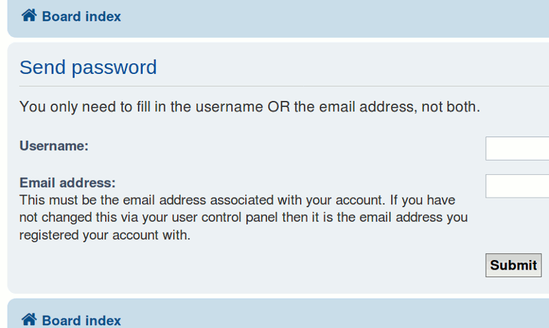

# phpBB Extension - marttiphpbb Username Or Email Password Reset

[Topic on phpBB.com]()

By default in a phpBB board you need to provide both username and email to reset your password. With this extension you only need one of them.

Only users with a unique email address in the database can use the email addres to request a new password. It is recommanded to check beforehand if all email addresses are unique. When you left the configuration option "Allow email address re-use" in the ACP (General > Board configuration > User registration settings) to the default "false" in your board, this will be the case.

## Requirements

* phpBB 3.2.x
* PHP 7+

## To do

Add console command to check for uniqueness of email addresses.

## Quick Install

You can install this on the latest release of phpBB 3.2 by following the steps below:

* Create `marttiphpbb/usernameoremailpasswordreset` in the `ext` directory.
* Download and unpack the repository into `ext/marttiphpbb/usernameoremailpasswordreset`
* Enable `Username Or Email Password Reset` in the ACP at `Customise -> Manage extensions`.

## Uninstall

* Disable `Username Or Email Password Reset` in the ACP at `Customise -> Extension Management -> Extensions`.
* To permanently uninstall, click `Delete Data`. Optionally delete the `/ext/marttiphpbb/usernameoremailpasswordreset` directory.

## Support

* Report bugs and other issues to the [Issue Tracker](https://github.com/marttiphpbb/phpbb-ext-usernameoremailpasswordreset/issues).

## License

[GPL-2.0](license.txt)

## Screenshot

